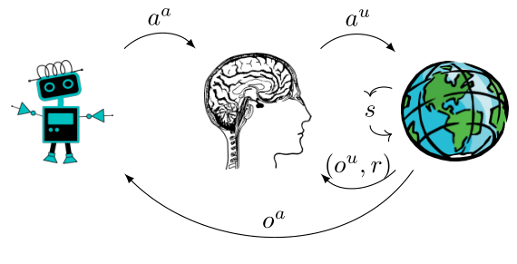

# AI-assistance at the Probabilistic Machine Learning group at Aalto

AI has recently shown impressive advances, from learning to play the Atari
games to defeating expert human players in the game of Go. Beyond games, AI has
also exploded in fields such as computer vision and natural language
processing, where vast amounts of labeled data are available. More broadly
speaking, technology as a whole has massively changed the landscape of most
fields. However, current approaches can only help in tasks where we either can
precisely specify the objective or already have plenty of observations of
solutions to learn from.

However, important real-world problems rarely have well-specified objectives or
solutions to learn from. Instead, most problems depend on the goals and
preferences of humans - the users - who are solving them. As a result, we need
approaches that explicitly consider the user. We, the [multi-agent modeling
team of FCAI](https://fcai.fi/fcai-teams#6), do exactly that by developing
techniques and methods that assist users in their tasks:

Here you can find a sample of our work.

## Tutorial

Consider checking out our
[tutorial](https://github.com/AaltoPML/ai_assistance_tutorial) where you can
see and play around with a concrete application of AI-assistance.

## AI assistants for designers

This paper presents the general AI-assisted Design framework. Based on the
recent rise in the use of AI in design practice, and on gaps that remain in
current assistance systems for design, it argues for a new assistance paradigm:
AI-assisted Design. We focus particularly on the experience of the designer,
explaining why designer autonomy, as well as control over the AI assistant, is
important for ownership and effectiveness. We explain the general outlines of
the AI-assisted design framework and go in depth on some of the more novel
aspect, including the need for user modelling and how one can ensure designer
control.

De Peuter, S., Oulasvirta, A., & Kaski, S. (2023). Toward AI assistants that let designers design. AI Magazine, 44(1), 85-96.

## Differential user models

Probabilistic user modeling is essential for building machine learning systems
in the ubiquitous cases with humans in the loop. However, modern advanced user
models, often designed as cognitive behavior simulators, are incompatible with
modern machine learning pipelines and computationally prohibitive for most
practical applications. In this work, we address this problem by introducing
widely-applicable end-to-end differentiable surrogates for bypassing this
computational bottleneck; the surrogates enable inference with modern cognitive
models in modern machine learning with online computational cost.

Alex Hämäläinen, Mustafa Mert Çelikok, and Samuel Kaski. Differentiable user models. The 39th Conference on Uncertainty in Artificial Intelligence, 2023.

## Zero-shot assistance

This paper presents a general-purpose instance of the AI-assisted design
framework. We formulate an instance in which an assistant helps an agent (f.ex.
a human) solve a decision problem through advice. We focus particularly on the
negative effect of biases within the agent on the effectiveness of advice, and
show that modelling biases can help mitigate these effects. Finally, we
introduce an MCTS-based planning algorithm for finding the assistant’s optimal
advice policy.

De Peuter, S., & Kaski, S. (2022). Zero-Shot Assistance in Sequential Decision Problems.

## Cooperative optimization

The paper describes a cooperative Bayesian Optimization problem where two
agents work together to optimize black-box functions of two variables. This
approach is motivated by collaboration between humans and AI, where an
AI-assistant helps a human user solve a problem through collaborative
optimization. The solution involves strategic planning of queries using Bayes
Adaptive Monte Carlo planning and a user model that accounts for conservative
belief updates and exploratory sampling of points to query. The paper presents
a promising approach to cooperative optimization that has practical
applications in human-AI teamwork.

Ali Khoshvishkaie, Petrus Mikkola, Pierre-Alexandre Murena, Samuel Kaski.
Cooperative Bayesian optimization for imperfect agents. ECML-PKDD 2023

# `Jupyter notebook` setup Instructions

We recommend either:
1. Using Google Collab (if you have a Google account)
2. Setting up your own local environment

## Instructions for Google Collab
Due to slight differences in how jupyter notebooks are rendered in Google Collab, you'll need to *use the files located in the "Google Collab" folder*.

1. Download or clone the repo.
2. Make sure you're signed into your Google account and open [Google Collab](https://colab.research.google.com/)
3. Navigate to the `Upload` tab > click `choose file` > go under the "Google Collab" directory > select the `AI_assistance_Tutorial.ipynb` file
4. Run the first cell in the notebook (it might take a bit of time for the Google backend to activate your virtual machine)
5. When the cell successfully runs, click `choose file` again and select the following two files for upload:
    - `tutorialObjs.py`
    - `ai-assistance-overview.png`
6. Run the subsequent import cell to verify you don't have any errors.

## Instructions for local environment
### Requirements
- Python 3 (we've tested on 3.8 and 3.9)
- `jupyter notebook`
- packages in `requirements.txt` 

### For `pyenv` or `virtualenv`
1. Download or clone the repo.
2. Instructions can differ depending on your tool, so if you need help, reference [this external source](https://realpython.com/intro-to-pyenv/#virtual-environments-and-pyenv)

3. Once your environment is activated, remember to run `pip install -r requirements.txt`.

4. Run the `jupyter notebook` command

5. Open the `AI_assistance_Tutorial.ipynb` file and run the first cell to verify all imports were completed without error
  
### For `Anaconda` environments
1. Download or clone the repo.
2. To creat a new environment named "myenv" with Python 3.8 installed, run the following command:

    `conda create --name myenv python=3.8`

3. After creating the environment, you need to activate it before installing any packages. Do this with the following command:

    `conda activate myenv`

4. Run the following command to install all the packages in `requirements.txt`:

    `conda install --file requirements.txt`

5. Run the `jupyter notebook` command

6. Open the `AI_assistance_Tutorial.ipynb` file from jupyter and run the first cell to verify all imports were completed without error

